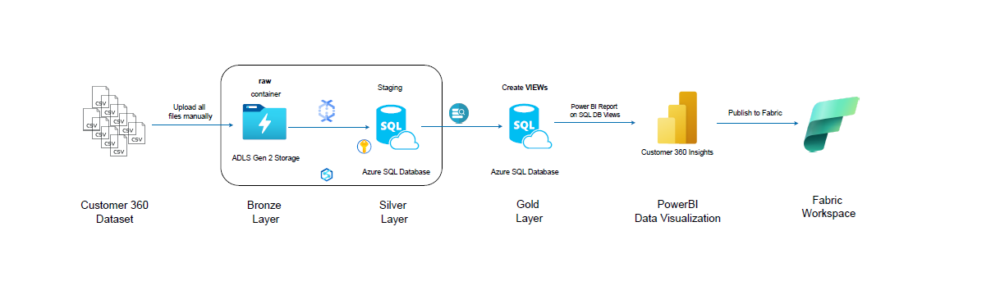
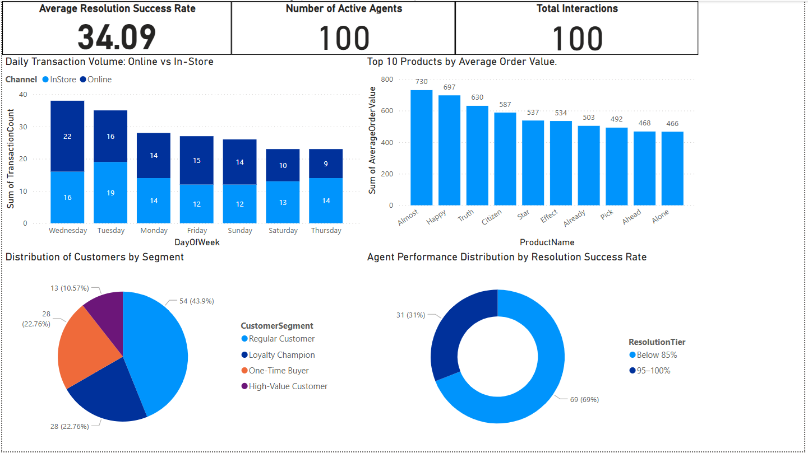

# Project 3: Customer 360 Data Integration

📌 Overview

This project builds a Customer 360 view by integrating multiple sources such as online transactions, in-store purchases, customer service interactions, and loyalty programs.
The goal is to create a scalable, clean, and analytics-ready data pipeline using Azure services and Power BI.

---
### ETL Workflow

---
### 🛠️ Technologies Used

- Azure Data Lake Gen2 (Storage)
- Azure Synapse Analytics (Pipelines and SQL Pools)
- Azure SQL Database
- Azure Key Vault (Secrets Management)
- Power BI (Visualization & Dashboarding)

---

### 🧩 Project Steps

1. Data Ingestion

- Created /bronze/ folder in ADLS Gen2 and uploaded raw CSV files.
- Set up Synapse pipelines to ingest data into the Bronze layer. 
- Connected Azure SQL Database using Azure Key Vault for secure credentials.

2. Data Transformation (Bronze ➔ Silver Layer)
   
- Built dataflows in Synapse to clean and standardize data.
- Applied filters, aggregation (to remove duplicates), and alter row transformations.
- Loaded cleaned data into staging tables (Silver layer) in Azure SQL Database.

3. Data Modeling (Silver ➔ Gold Layer)

Created 4 analytical views:

- View_1_InStoreAverageOrderValue
- View_1_OTAverageOrderValue
- View_2_CustomerSegmentation
- View_3_PeakTimes
- View_4_AgentPerformance

These views provided clean, business-ready data models for analysis.

4. Reporting & Dashboarding

- Connected Power BI to Azure SQL Database (Import Mode).
- Published the final dashboard to Microsoft Fabric Workspace.
---
### Dashboard

---
### 📈 Key Learnings

- Structured layering: Bronze ➔ Silver ➔ Gold improves data quality and maintainability.
- Azure Key Vault integration improves security by avoiding hardcoded secrets.
- Power BI "Top N" filtering and KPI visuals enhance dashboard clarity.
- Business-focused views (Gold layer) simplify reporting for non-technical users.

---

Connect with me on my profile below for more updates:

LinkedIn: https://www.linkedin.com/in/harpalvaghela/

Website: https://www.harpalvaghela.com

Medium Blog: https://medium.com/@harpalvaghela

Thank you
